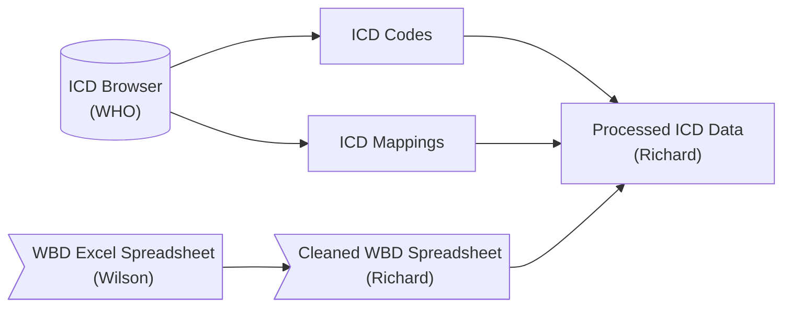
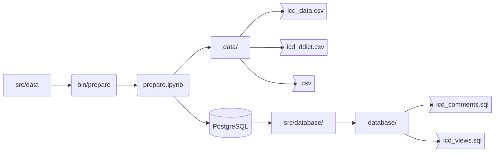

# Developer Notes for Processed ICD Data

* [Preparation](#preparation)
* [Requests](#requests)

This document details data access and preparation of the processed ICD datasets for use.

## Overview



The ICD data was downloaded from the World Health Organization (WHO) through their [ICD-11 Browser](https://icd.who.int/browse11/l-m/en) (under `Info` select `Spreadsheet File` for the ICD-11 codes and `ICD-10 / ICD-11 mapping Tables` for the ICD-10 and ICD-11 mappings).

The WBD data was retrieved from Wilson Suraweera <Wilson.Suraweera@unityhealth.to> as an Excel Spreadsheet (copy available [here](src/data/Version%2010%20-%20Final%20CGHR-GBD%20list%2018%20April%202013.xls)), and edited by Richard Wen <rrwen.dev@gmail.com> manually to be parsed in an R Script (script files available [here](src/R)) into a cleaned WBD Excel Spreadsheet (copy available [here](src/data/Version%2010%20-%20Final%20CGHR-GBD%20list%2018%20April%202013%20RW.xls)).

These data are then processed and managed by Richard Wen <rrwen.dev@gmail.com> using scripts in this repository.

For more details on the data, see the following files from the WHO:

* [icd_map_readme.txt](src/data/icd_map_readme.txt): original readme file for the raw icd 10 and 11 mappings
* [icd11_readme.txt](src/data/icd11_readme.txt): original readme file for the raw icd 11 codes

## Install

1. Install [Anaconda 3](https://www.anaconda.com/)
2. Install [PostgreSQL 12+](https://www.postgresql.org/)
3. Run `bin/install` to create a `conda` environment
4. Activate the `conda` environment (named `icd`)

In Windows:

```
bin\install
bin\activate
```

In Linux/Mac OS:

```
source bin/install.sh
source bin/activate.sh
```

## Setup

In order to upload the data to a PostgreSQL database (optional) with the Python scripts in the `src` folder, you will need to login to your database.

To do this, run the `bin/login.bat` or `bin/login.sh` files depending on your operating system.

In Windows:

```
bin\login
```

In Linux/Mac OS:

```
source bin/login.sh
```

You will be prompted to enter database connection details, and if successful, it will display that the login has been saved.

**Note **: the password prompt is hidden - simply enter your password and press enter to proceed

## Preparation



Once the [Setup](#setup) step is successful, the datasets can be prepared by running the following in a command line terminal (depending on your operating system):

In Windows:

```
bin\prepare
```

In Linux/Mac OS:

```
source bin/prepare.sh
```

This uses the Python Jupyter notebook [prepare.ipynb](src/prepare.ipynb) to:

1. Process the raw data files in `src/data` into cleaned datasets
2. Save the cleaned datasets in the `data` folder as `.csv` files
3. Create data dictionaries using the `config.yml` file for all columns in the cleaned datasets and save them in the `data` folder
4. Optionally, upload the cleaned datasets into the upload database defined in the [Setup](#setup) step
5. Optionally, create the following files in `src/database` from the data uploaded to the database:
   * `icd_comments.sql`: contains PostgreSQL code for adding comments to the datasets
   * `icd_views.sql`: contains PostgreSQL code for creating up to date views of the datasets without versioning
   * `icd_tables.dump`: contains a PostgreSQL dump of the datasets in the database for uploading to another database

**Note**: This process takes about 5 minutes.

## Requests

The data is openly available in the [data](data) folder. See the [Access](README.md#access) section for more details.

For CGHR staff, the data is also available on a database. See [Database Login](#database-login) for more details.

### Database Login

The ICD data is available in the CGHR database named `research1` where the latest data are available as views with the same dataset names as in the file [icd_data.csv](data/icd_data.csv).

To provide permitted users access to this database, please contact Peter Rodriguez <Peter.Rodriguez@unityhealth.to> to create a user logins and for connection details, where he will provide the following to the permitted user:

* Host address
* Port number
* Database name
* User name
* Password

**Reminder**: These users should have a role that only permits them access to the research database.

## Contact

Richard Wen <rrwen.dev@gmail.com>
