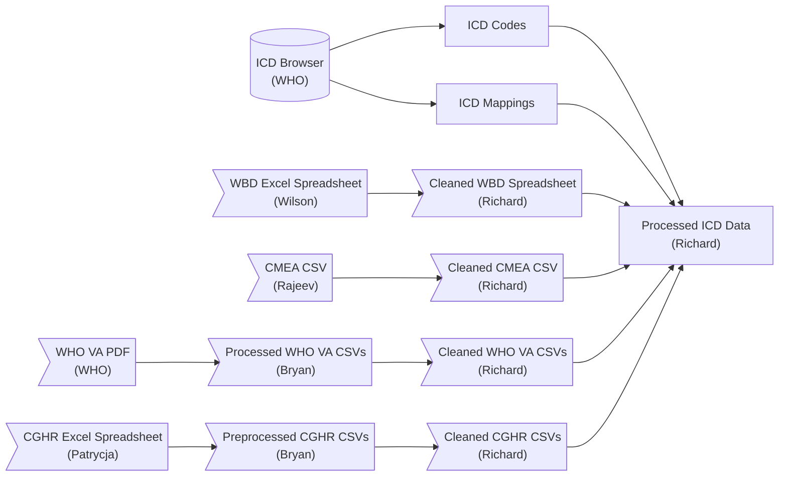
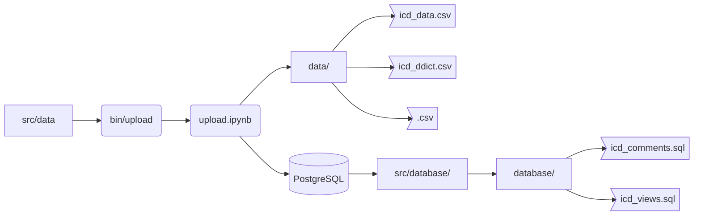

# Developer Notes for Processed ICD Data

* [Preparation](#preparation)

This document details the preparation of the processed ICD datasets for use.

## Overview



The ICD data was downloaded from the World Health Organization (WHO) through their [ICD-11 Browser](https://icd.who.int/browse11/l-m/en) (under `Info` select `Spreadsheet File` for the ICD-11 codes and `ICD-10 / ICD-11 mapping Tables` for the ICD-10 and ICD-11 mappings).

The WBD data was retrieved from Wilson Suraweera <Wilson.Suraweera@unityhealth.to> as an Excel Spreadsheet (copy available [here](src/data/Version%2010%20-%20Final%20CGHR-GBD%20list%2018%20April%202013.xls)), and edited by Richard Wen <rrwen.dev@gmail.com> manually to be parsed in an R Script [here](src/R/wbd10.rmd) into a cleaned WBD Excel Spreadsheet (copy available [here](src/data/Version%2010%20-%20Final%20CGHR-GBD%20list%2018%20April%202013%20RW.xls)).

The CMEA data was retrieved from Rajeev Kamadod <rajeevk@kentropy.com> as a CSV file (copy available [here](src/data/icd10-equivalent-1.csv)), and processed in an R Script [here](src/R/cmea10.rmd) into a cleaned CMEA files [cmea10_raw.csv](src/data/cmea10_raw.csv) and [icd10tocmea10_raw.csv](src/data/icd10tocmea10_raw.csv).

The WHO VA data was collected and processed by Bryan Gascon <bryan.gascon@mail.utoronto.ca> as a CSV file from the WHO VA manuals (copies for [WHO VA 2016](src/data/whovatoicd10mapping.csv) and [WHO VA 2022](src/data/whova2022toicd10mapping.csv) available), and processed in an R Script for [2016](src/R/wva2016.rmd) and [2022](src/R/wva2022.rmd) codes in cleaned WHO VA files [wva2016_raw.csv](src/data/wva2016_raw.csv) and [wva2022_raw.csv](src/data/wva2022_raw).

The CGHR codes were extracted from the [Automated Versus Physician (AVP) study](https://doi.org/10.1186/s12916-019-1353-2) by Patrycja Kolpak <Patrycja.Kolpak@unityhealth.to> into an Excel Spreadsheet (copy [here](src/data/cghr2019_avp_raw_ddict.xlsx)) and processed by Bryan Gascon <bryan.gascon@mail.utoronto.ca> into several files (WHO VA to CGHR - [adult](src/data/wva2016tocghr_adult.csv) [child](src/data/wva2016tocghr_child.csv) [neo](src/data/wva2016tocghr_neo.csv), WHO VA to WBD - [adult](src/data/wva2016towbd10_adult.csv) [child](src/data/wva2016towbd10_child.csv) [neo](src/data/wva2016towbd10_neo.csv), CGHR to WBD - [adult](src/data/cghrtowbd10_adult.csv) [child](src/data/cghrtowbd10_child.csv) [neo](src/data/cghrtowbd10_neo.csv)). These were then cleaned with an R Script [here](src/R/cghr2019.rmd) into files [cghr2019_raw.csv](src/data/cghr2019_raw.csv), [cghr2019towbd10_raw.csv](src/data/cghr2019towbd10_raw.csv), [wva2016tocghr2019_raw.csv](src/data/wva2016tocghr2019_raw.csv), and [wva2016towbd10_raw.csv](src/data/wva2016towbd10_raw.csv).

These data are then processed and managed by Richard Wen <rrwen.dev@gmail.com> using scripts in this repository.

For more details on the data, see the following files from the WHO:

* [icd_map_readme.txt](src/data/icd_map_readme.txt): original readme file for the raw icd 10 and 11 mappings
* [icd11_readme.txt](src/data/icd11_readme.txt): original readme file for the raw icd 11 codes

## Install

1. Install [Python 3.11](https://www.python.org/)
2. Install [PostgreSQL 12+](https://www.postgresql.org/)
3. Run `bin/install` to create a `venv` environment
4. Activate the `venv` environment

In Windows:

```
bin\install
bin\activate
```

In Linux/Mac OS:

```
source bin/install.sh
source bin/activate.sh
```

## Setup

In order to upload the data to a PostgreSQL database (optional) with the Python scripts in the `src` folder, you will need to login to your database.

To do this, run the `bin/login.bat` or `bin/login.sh` files depending on your operating system.

In Windows:

```
bin\login
```

In Linux/Mac OS:

```
source bin/login.sh
```

You will be prompted to enter database connection details, and if successful, it will display that the login has been saved.

**Note**: the password prompt is hidden - simply enter your password and press enter to proceed

## Preparation



Once the [Setup](#setup) step is successful, the datasets can be prepared by running the following in a command line terminal (depending on your operating system):

In Windows:

```
bin\run
```

In Linux/Mac OS:

```
source bin/run.sh
```

This uses the Python Jupyter notebook [upload.ipynb](src/upload.ipynb) and [update.ipynb](src/udate.ipynb) to:

1. Process the raw data files in `src/data` into cleaned datasets
2. Save the cleaned datasets in the `data` folder as `.csv` files
3. Create data dictionaries using the `config.yml` file for all columns in the cleaned datasets and save them in the `data` folder
4. Optionally, upload the cleaned datasets into the upload database defined in the [Setup](#setup) step
5. Optionally, create the following files in `src/database` from the data uploaded to the database:
   * `icd_comments.sql`: contains PostgreSQL code for adding comments to the datasets
   * `icd_views.sql`: contains PostgreSQL code for creating up to date views of the datasets without versioning
   * `icd_tables.dump`: contains a PostgreSQL dump of the datasets in the database for uploading to another database

**Note**: This process takes about 5 minutes.

## Contact

Richard Wen <rrwen.dev@gmail.com>
