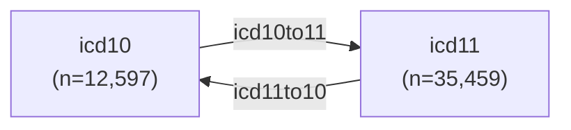

# Processed ICD Datasets

* [Descriptions](icd_data.csv)
* [Dictionary](icd_ddict.csv)

This document details the data dictionary and descriptions of the processed ICD datasets.

## Overview

The data contain two groups of datasets:

1. ICD codes with their titles and structures (chapter, entity, etc)
2. ICD mappings for translating between ICD revisions

Refer to the following files for more information:

* [icd_data.csv](icd_data.csv): Descriptions for each dataset
* [icd_ddict.csv](icd_ddict.csv): Column descriptions for each dataset

## Contact

Richard Wen <rrwen.dev@gmail.com>
