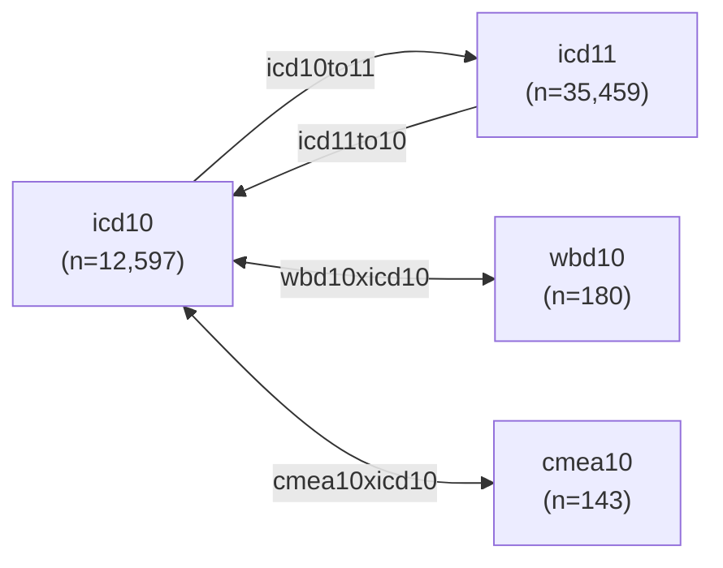

# Processed ICD Datasets

* [Descriptions](icd_data.csv)
* [Dictionary](icd_ddict.csv)

This document details the data dictionary and descriptions of the processed ICD datasets.

## Overview

The data contain four groups of datasets:

1. ICD codes with their titles and structures (chapter, entity, etc)
2. ICD/WBD/CMEA mappings for translating between ICD and WBD revisions
3. WBD codes with their titles and structures (codex4, codex2, etc)
4. CMEA codes with their titles and ICD-10 agreement code ranges

Refer to the following files for more information:

* [icd_data.csv](icd_data.csv): Descriptions for each dataset
* [icd_ddict.csv](icd_ddict.csv): Column descriptions for each dataset

## ICD Code Agreements in Verbal Autopsy (VA) Records

For VA records at CGHR, a Central Medical Evaluation Agreement (CMEA) list of ICD-10 blocks (see [cmea10](cmea10.csv)) are used to check if two randomly assigned physicians agree on a ICD-10 Cause of Death (COD) assignment.

To check whether two ICD-10 codes are in agreement, use the [cmea10xicd10](cmea10xicd10.csv) dataset:

1. Join physician 1 ICD-10 codes by the column `icd10_code`
2. Join physician 2 ICD-10 codes by the column `icd10_code`
3. Check for equivalence using the column `cmea_title` (agreement blocks)

For example, a dataset with physician 1 and 2 ICD-10 codes is given:

| p1_icd | p2_icd |
| ------ | ------ |
| A00 | A05 |
| A00 | A51 |

Using [cmea10xicd10](cmea10xicd10.csv), we left join the column `icd10_code` to columns `p1_icd` and `p2_icd` in this dataset:

| p1_icd | p2_icd | cmea_title_p1       | cmea_title_p2       |
| ------ | ------ | ------------------- | ------------------- |
| A00    | A05    | Diarrhoeal diseases | Diarrhoeal diseases |
| A00    | A51    | Diarrhoeal diseases | Syphilis            |

We can then check if `p1_icd` and `p2_icd` agree using `cmea_title_p1` and `cmea_title_p2`:

| p1_icd | p2_icd | cmea_title_p1       | cmea_title_p2       | agreement |
| ------ | ------ | ------------------- | ------------------- | --------- |
| A00    | A05    | Diarrhoeal diseases | Diarrhoeal diseases | Yes       |
| A00    | A51    | Diarrhoeal diseases | Syphilis            | No        |

## Contact

Richard Wen <rrwen.dev@gmail.com>
