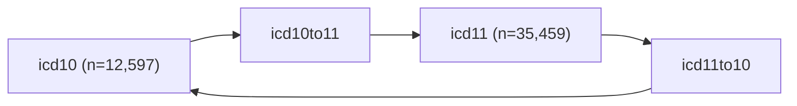

# Processed ICD Datasets

* [Descriptions](icd_data.csv)
* [Dictionary](icd_ddict.csv)

This document details the data dictionary and descriptions of the processed ICD datasets.

## Overview

The data contain both ICD-10 and ICD-11 codes with their titles and structures (chapter, entity, etc):

* [icd10](icd10.csv): ICD-10 codes, titles, and structure
* [icd11](icd11.csv): ICD-11 codes, titles and structure

There are also data for translating codes between ICD-10 and ICD-11:

* [icd10to11](icd10to11.csv): ICD-10 to ICD-11 mappings
* [icd11to10](icd11to10.csv): ICD-11 to ICD-10 mappings, ICD-11 codes may map to multiple ICD-10 codes

Refer to the following files for more information:

* [icd_data.csv](icd_data.csv): Descriptions for each dataset
* [icd_ddict.csv](icd_ddict.csv): Column descriptions for each dataset

## Contact

Richard Wen <rrwen.dev@gmail.com>
