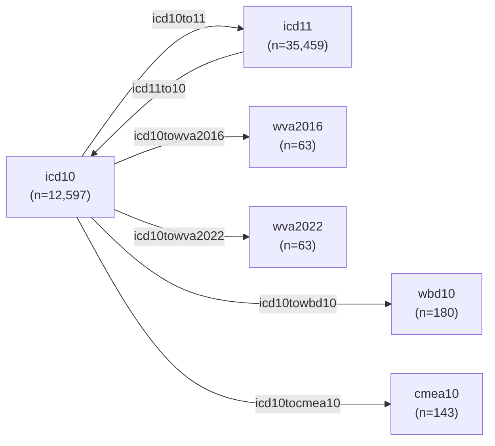

# Processed ICD Datasets

* [Descriptions](icd_data.csv)
* [Dictionary](icd_ddict.csv)

This document details the data dictionary and descriptions of the processed ICD datasets.

## Overview

The data contain four groups of datasets:

1. ICD codes with their titles and structures (chapter, entity, etc)
2. ICD/WVA/WBD/CMEA mappings for translating between ICD and other codes
3. WVA codes with their titles and ICD-10 code ranges
4. WBD codes with their titles and structures (codex4, codex2, etc)
5. CMEA codes with their titles and ICD-10 agreement code ranges

Refer to the following files for more information:

* [icd_data.csv](icd_data.csv): Descriptions for each dataset
* [icd_ddict.csv](icd_ddict.csv): Column descriptions for each dataset

## Mapping ICD-10 Codes to Other Coding Standards

ICD-10 codes can be remapped to other coding standards (WVA, WBD, etc) and other revisions (ICD-11).

To remap ICD-10 codes to other coding standards, use a mapping dataset (e.g. [icd10towbd10](icd10towbd10.csv), [icd10towva2016](icd10towva2016), etc):

1. Join the ICD-10 codes column in your data to the column `icd10_code` in the mapping dataset
2. The remapped codes are in a separate column depending on the standard - for example:
    * Remapped WBD-10 codes are in the column `wbd10_code`
    * Remapped WVA 2016 codes are in the column `wva2016_code`

To provide an example, given a dataset with ICD-10 codes for adults (12-69 years old):

| rowid | icd_code |
| ----- | -------- |
| 1 | A05 |
| 2 | A51 |

Since the WBD-10 codes are grouped by `adult` (12-69 years old), `child` (1 month to 11 years old), and `neo` (under 1 month old) in the `wbd10_age` column, we need to filer for adult codes only in the [icd10towbd10](icd10towbd10.csv) dataset:

| wbd10_age | ... | icd_code |
| --------- | --- | -------- |
| adult | ... | A00 |
| adult | ... | A51 |
| ... | ... | ... |

We then left join the column `icd_code` (left) to the column `icd10_code` column in [icd10towbd10](icd10towbd10.csv) (right) to get the remapped WBD-10 codes in the `wbd10_code` column:

| rowid | icd_code | wbd10_code |
| ----- | -------- | ---------- |
| 1 | A05 | A05 | 1D01 |
| 2 | A51 | A51 | 1C01 |

## ICD Code Agreements in Verbal Autopsy (VA) Records

For VA records at CGHR, a Central Medical Evaluation Agreement (CMEA) list of ICD-10 blocks (see [cmea10](cmea10.csv)) are used to check if two randomly assigned physicians agree on a ICD-10 Cause of Death (COD) assignment.

To check whether two ICD-10 codes are in agreement, use the [icd10tocmea10](icd10tocmea10.csv) dataset:

1. Join physician 1 ICD-10 codes by the column `icd10_code`
2. Join physician 2 ICD-10 codes by the column `icd10_code`
3. Check for equivalence using the column `cmea_title` (agreement blocks)

For example, a dataset with physician 1 and 2 ICD-10 codes is given:

| p1_icd | p2_icd |
| ------ | ------ |
| A00 | A05 |
| A00 | A51 |

We left join the columns `p1_icd` and `p2_icd` in this dataset (left) to the column `icd10_code` in [icd10tocmea10](icd10tocmea10.csv) (right):

| p1_icd | p2_icd | cmea_title_p1       | cmea_title_p2       |
| ------ | ------ | ------------------- | ------------------- |
| A00    | A05    | Diarrhoeal diseases | Diarrhoeal diseases |
| A00    | A51    | Diarrhoeal diseases | Syphilis            |

We can then check if `p1_icd` and `p2_icd` agree using `cmea_title_p1` and `cmea_title_p2`:

| p1_icd | p2_icd | cmea_title_p1       | cmea_title_p2       | agreement |
| ------ | ------ | ------------------- | ------------------- | --------- |
| A00    | A05    | Diarrhoeal diseases | Diarrhoeal diseases | Yes       |
| A00    | A51    | Diarrhoeal diseases | Syphilis            | No        |

## Contact

Richard Wen <rrwen.dev@gmail.com>
